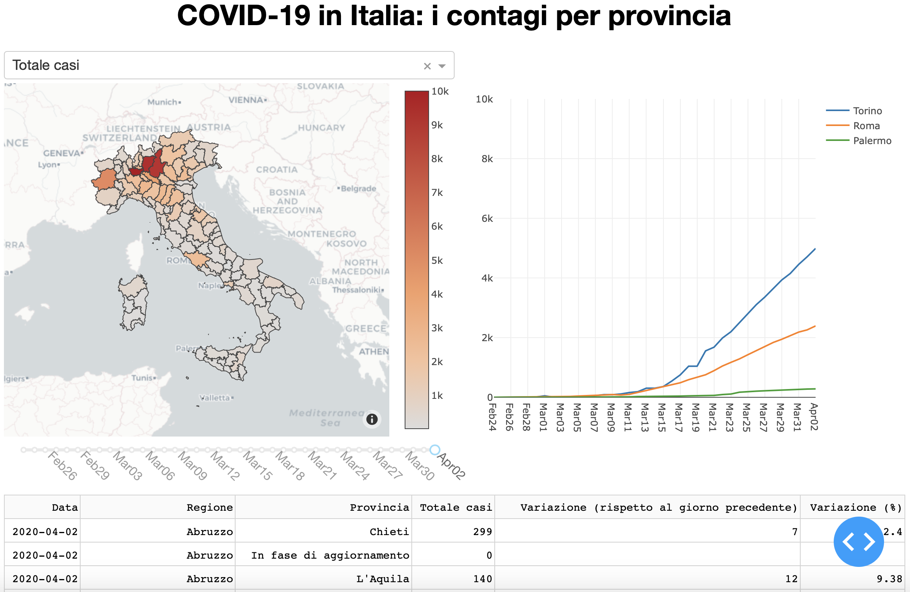

# A dashboard to monitor the spread of COVID-19 in Italy

*See the dashboard in action on [Heroku](http://covid19ita-dash.herokuapp.com)*



### What is it?

This dashboard graphically represents the updated COVID-19 situation in Italy using [data publicly available](https://github.com/pcm-dpc/COVID-19). It allows to compare the number of cases across the Italian provinces for a given date, but also to observe trends in time and sum up the details in a table. 

### What's under the hood?

It is written in Python using Dash. It can be run using Jupyter Lab or as a Flask-based web application.

### Using the dashboard in Jupyter Lab

To use the dashboard inside Jupyter Lab, it is necessary to install the [jupyterlab-dash extension](https://github.com/plotly/jupyterlab-dash).

### Running the web app locally

The easiest way is to clone this repository, create a virtual environment and install the required packages:

```
virtualenv -p python3 venv
source venv/bin/activate
pip install -r requirements.txt
```

To run the actual web app:

```
python app.py
```

The dashboard can then be used in a browser pointing to link http://127.0.0.1:8050/ .

### Deploying the app

The main app uses Choroplethmapbox to represent measures of interest. Although updating it through a given component is fine locally, it can be quite heavy if the app is deployed on Heroku or AWS. Under the folder *deploy*, there is a slightly different implementation (the one actually hosted on Heroku) that uses Scattermapbox instead.